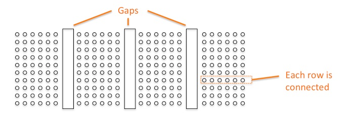
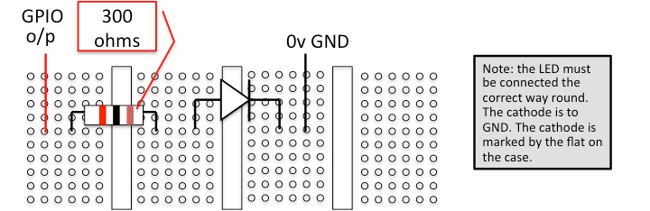

# Lab Exercise Week 2

## GPIO

This lab exercise builds on the [Lab Exercise Week 1](../week_1).

The LED must be connected with a series resistor to limit the current. Use a red
LED and a resistor of 300 ohms. Note excess current may damage the Freedom
board.

The circuit is built on the breadboard:

For example:

Change the configuration code to instead (or also) flash the external LED.

The name of the KL25Z pin that you choose gives the GPIO port.
