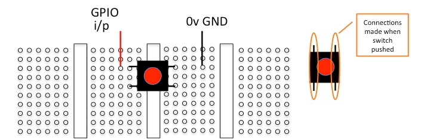

# Lab Exercise Week 3

## Button using an Interrupt

This lab exercise connects an input device (a button) to the Freedom board and
introduces interrupts.

The button can be connected directly between two pins on the breadboard:

The pins are:

- GPIO input to port D pin6, which is J2 pin 17.
- Ground (0v), which is J2 pin 14.

The picture below shows these pins on Freedom board:

The program flashes the red LED for 1 second each time the button is pressed.

The aim is to modify the program so that the lights progress through a sequence
of colour on each button press. For example, at first all lights are off, then
'red' lights with the first button press, then 'red' and 'green' with the next,
and so on. A proposed design is:

- From the interrupt handler, increment a counter on each button press.
- Use the three least significant bits to set the colours. Thus:
  - The red LED corresponds to counter & 1.
  - The green LED corresponds to counter & 2.
  - The blue LED corresponds to counter & 4.

Note that the counter variable must be marked as volatile.
