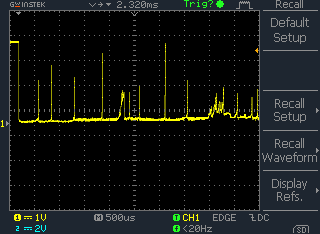

# Lab Exercise Week 4

## Interrupt Timing and `SysTick`

This lab exercise extends the [Lab Exercise Week 3](../week_3), which used an
interrupt to handle a button press. There are two aims:

- Use an oscilloscope to find out how long it takes the microcontroller to
  respond to an interrupt.
- Use the `SysTick` timer to prevent button bounce.

Each press of the button can cause many interrupts. A button 'bounce' happens
when very fast electrical transients create the appearance of the button
switching on and off rapidly several times before reaching a stable state. The
first aim of this lab is to look at the timescales involved.

An oscilloscope can be used to observe the button bounce. An example trace is
shown here:

For the second task:

- Use the program from [Lab Exercise Week 3](../week_3) to obtain a similar
  trace (note: the one above used a button design that is liable to bounce).
- Enhance the program to set with a debug GPIO output, which is connected to the
  oscilloscope. Set it to 1 at the start of the interrupt and 0 at the end.
- Measure both the time taken in the interrupt and the delay between the button
  press and the interrupt.

For the second task, use the `SysTick` to create a delay that is sued to
debounce the button, that is, to ignore interrupts from the button for a
suitable time after a press. A possible design is:

- A volatile variable `buttonDelay` is set to e.g. 100 when the button is
  pressed.
- The `SysTick` handler decrements the button `buttonDelay` variable until it
  reaches zero.
- The interrupt handler sets increments a counter for each button press but only
  when the `buttonDelay` has reached zero.
