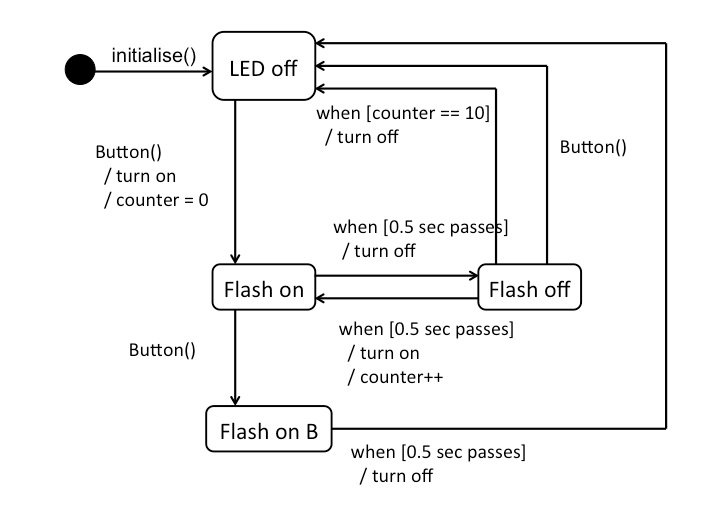

# Lab Exercise Week 5

## Interrupts and Cyclic Execution

The aim of this lab exercise is to write simple programs using cyclic execution.
The lab builds on [Lab Exercise Week 4](../week_4), which used the `SysTick`
timer. The goal is to implement a given state transition diagram `n` a cyclic
design, using the `SysTick` timer.

### Requirement

Press the button to turn an LED on. The LED should then flash, with equal on and
off times, and a period of 1 second. The LED stops flashing either after 10
flashes (i.e. 10 seconds) or when the button is pressed a second time.

The following state transition diagram models this requirement:

Implement this state transition diagram:

- Use the `systick` timer to execute transitions every e.g. 100 ms.
- Once a button press has occurred, ignore further interrupts for a small number
  of cycles.
