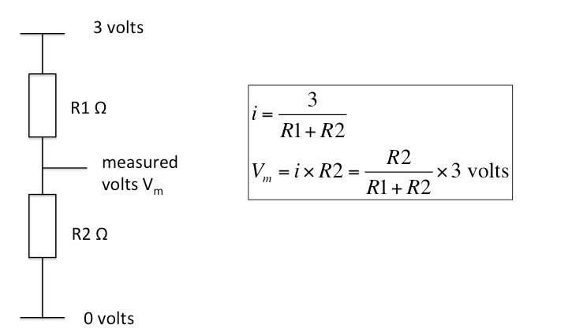
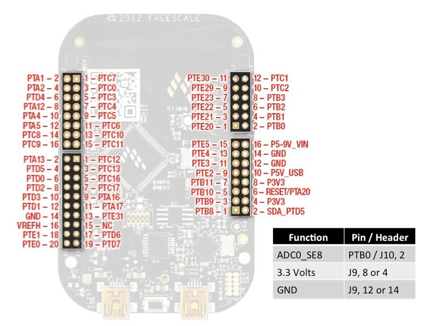
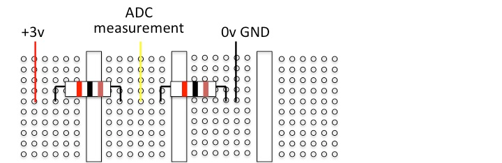
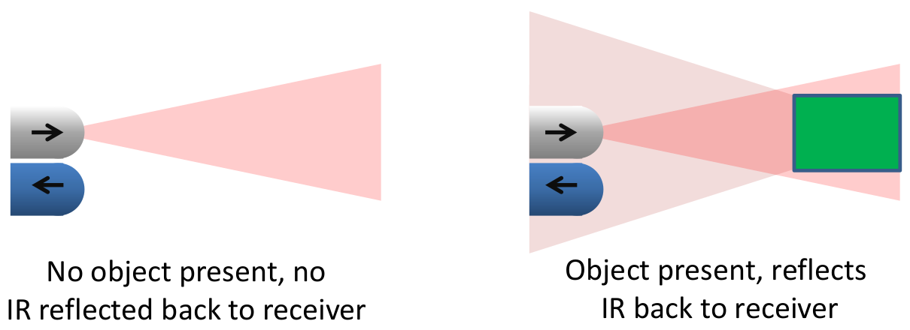
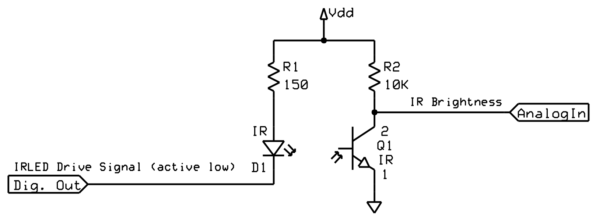

# Lab Exercise Week 6

## Analogue to Digital Conversion

This lab exercise covers the use of the Analogue to Digital Convertor (ADC).

An ADC is a way for the MCU to read (input) a value that varies continuously
over some range. This value - for example an angular position, or a temperature
\- must be converted to a voltage, which is read by the ADC. The ADC works by
comparing the voltage with a reference voltage. The MCU uses a reference voltage
of 3v so the converted voltage is in the range 0 to 3v.

To do the conversion, the ADC must draw some current and take some time. The
electrical characteristics of the ADC, including its input impedance, are given
in the MCU datasheet. We must take care that the current drawn by the ADC does
not significantly change the voltage we are trying to measure. Since the current
used by the ADC is a feature of its design, this means that the resistance
between the supply and the measured voltage should not be too large. If this is
not the case, then the ADC loses accuracy. The time depends on the accuracy in
bits and the frequency at which the ADC operates.

An ADC can be used to measure the voltage between two resisters.

### Circuit Principles

The ADC can be tested with a simple voltage divider.

The measured voltage should then be R2 / (R1 + R2) * 3 volts.

### Connections

The ADC measurement is on PTB0, which on J10 pin 2. Connect this to the measured
volts point of the voltage bridge.

The following picture shows the position of the 3.3v power supply output; there
are several GND (ground) connections: one is 2 rows above the 3.3v power supply
output.

Each group of 6 holes in the breadboard is connected and the resistors are
connected across the gap. The suggested values are 1KΩ and 330Ω.

### IR Proximity Sensor

In this part the goal is to build a simple proximity sensor. The proximity
sensor uses an IR emitter (LED) and an IR detector (phototransistor) pointing in
the same direction to determine if any object is reflecting IR energy from the
LED.

The proximity sensor works with a combination of hardware and software. Sensing
occurs in two steps: First, the software must measure the IR light level (using
IR-sensitive phototransistor Q1 and the analog to digital converter) when the
IR-emitting LED is turned off. Second, the software must measure the IR light
level when the IR LED is turned on. If the IR brightness level has increased,
then there may be an object nearby reflecting the IR from D1 back to Q1. The
signal strength is to be indicated by the RGB LED on the Freedom board.

You can verify that the IR LED is turned on by viewing it with a digital camera
(e.g. in a mobile phone), as these are sensitive to IR energy.

#### Circuit and Operation

Build the circuit on the breadboard as shown below:

| Identifier | Description                                                                    |
| ---------- | ------------------------------------------------------------------------------ |
| R1         | 150 Ω (brown-green-brown-gold)                                                 |
| R2         | 10 kΩ ohms (brown-black-orange-gold)                                           |
| D1         | The flat side of the package marks the cathode (negative terminal, long lead)  |
| Q1         | The flat side of the package marks the emitter (negative terminal, short lead) |

As IR energy increases, the conductivity of the phototransistor increases and
lowers the output voltage. However, the phototransistor has a slow response (try
measuring this with an oscilloscope).

#### Software Requirements and Design

The requirements for the range measurement software are:

- Take measurements by (i) turning the IR LED on, and waiting for a short while
  before measuring the voltage on the phototransistor, then (ii) turning the IR
  LED off, again waiting then measuring. The difference between the two voltage
  measurements indicates the presence of a reflecting object and the greater the
  difference the closer the object.
- Delays need to be of the order of 1ms or more.
- It is best to repeat the measurement multiple (e.g. 10) times and take the
  average.

The resulting range can be monitored using the debugger. The following software
functions are suggested:

1. Initialization functions: configures GPIO pins and ADC input.
2. `Control_IR_LED` function: turns on or off IR LED.
3. `Measure_IR` function: use the ADC to read the voltage level.
4. `Delay` function: performs delay loop based on function argument.
5. `Display_Range` function: display RGB LED based on range.

The main function initialises the system and then repeatedly measures difference
in brightness caused by lighting LED, averages this difference over a number of
measurements and displays the range using the RGB LED.

##### Delay

The sensitivity of the proximity sensor increases as you wait longer to sample the
phototransistor's voltage after changing the IR LED. (A delay function gives
only an approximate delay.)

##### Calibration

Calibrate your code so that the RGB LED is lit according to object distance,
shown below. Calibrate by adjusting the values in the array called `Threshold`,
declared in `main.c`. To ensure consistency, use the same object for all
calibration and testing.

| Colour  | Distance % Max Range | Example Distance       |
| ------- | -------------------- | ---------------------- |
| Green   | Out of range         | No object within 20 cm |
| Blue    | 80-100% max range    | 16-20 cm               |
| Yellow  | 60-80%               | 12-16 cm               |
| Red     | 40-60%               | 8-12 cm                |
| Magenta | 20-40%               | 4-8 cm                 |
| White   | < 20% max range      | 0-4 cm                 |
