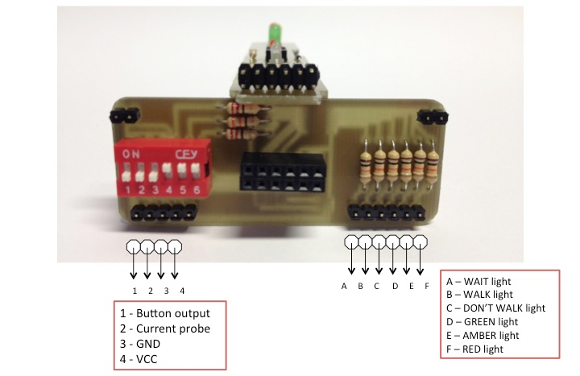
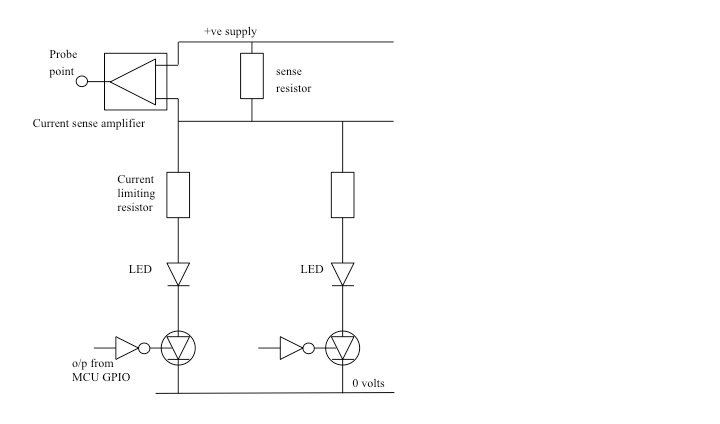
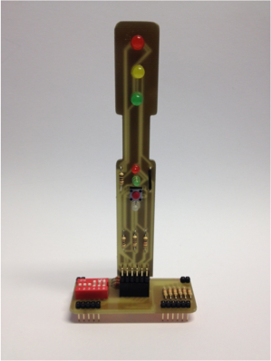
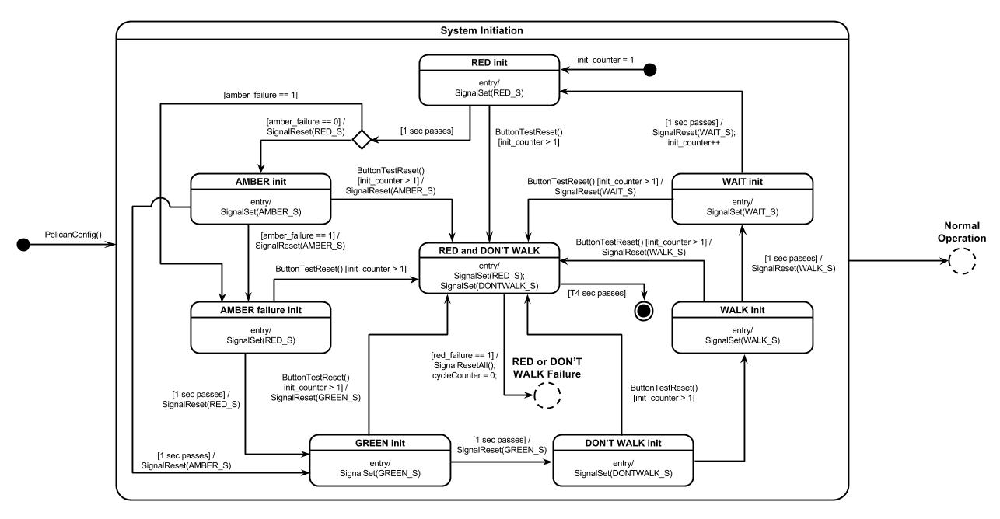
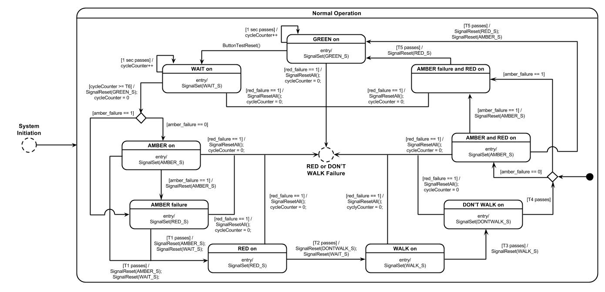
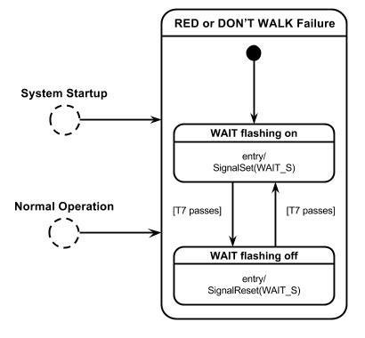

# Pelican Crossing Controller

## Requirements

To design software for a pelican (pedestrian) crossing controller.

- The state transition model (STM) should be a complete and consistent
  interpretation of the functional requirements, including detection of failures
  and behaviour following failures.
- The implementation should be a translation of the STM. It is recommended that
  the translation based on a `switch` statement is used.

## Functional Requirements

The traffic light system is made up from the following components:

- The RED vehicle light.
- The AMBER (i.e. orange) vehicle light.
- The GREEN vehicle light.
- The DON’T WALK (i.e. red) pedestrian light.
- The WALK (i.e. green) pedestrian light.
- The WAIT (white) light.
- The CROSSING request button.

The functional requirements are:

- When the system is started up all the light should flash on, one at a time,
  with a period of 1 second. The flashing continues until all lights have been
  flashed at least once, and the CROSSING button is pressed. The system is then
  in operation, with RED and DON'T WALK on. The system then operates
  continuously until reset.
- During the initialisation sequence, determine the current drawn by each bulb
  by measuring the voltage at the probe point. Use the measured values to detect
  failures in requirements 3 & 4.
- The traffic lights must follow the sequence:

  1. GREEN and DON'T WALK
  2. CROSSING button pressed; WAIT lights (see requirement 3)
  3. AMBER replaces GREEN; wait for T1 seconds
  4. RED replaces AMBER; wait for T2 seconds
  5. WALK replaces DON'T WALK; WAIT is extinguished; wait for T3 seconds
  6. DON'T WALK replaces WALK; wait for T4 seconds
  7. AMBER is added to RED; wait for T5 seconds
  8. GREEN replaces AMBER and RED

- The crossing does not allow pedestrians to cross too often. The GREEN light
  must be on for a minimum of T6 seconds.
- A failure of the RED or the DON'T WALK light causes the system to switch off.
  All lights are extinguished except for the WAIT light that is flashed with
  equal on and off period T7 second. The failure must be noticed within 100ms.
  The system remains in this state until reset. (See note in section 3.3)
- Failure of the AMBER causes the RED to be used instead. The failure must be
  noticed with 100ms. After a failure has been detected; the system should NOT
  attempt to use the AMBER again. (See note in section 3.3)
- The timings, which must be simple to change, have the default values:

```
T1  Amber time          10 sec
T2  Red before walk     10 sec
T3  Walk time           25 sec
T4  After walk time     15 sec
T5  Amber and red time  5 sec
T6  Green minimum       30 sec
T7  Flash period        3 sec
```

- There should be no noticeable delay between the CROSSING button being pressed
  and the WAIT light coming on.

## Traffic Light Hardware

The hardware consists of:

- A vertical board (or mast) holding the lights and the button.
- A baseboard, which plugs in the bread board and into which the vertical board
  plugs.

### Baseboard



Wires must be used to connect the Freedom board pins to the correct input pins
(shown above) on the breadboard.

### Connections

| Functions                 | In/Output | GPIO Port, Pin | Freedom Board |
| ------------------------- | --------- | -------------- | ------------- |
| RED light                 | Output    | PTE, 3         | J9, pin 11    |
| AMBER light               | Output    | PTE, 4         | J9, pin 13    |
| GREEN light               | Output    | PTE, 5         | J9, pin 15    |
| DON'T WALK (red) light    | Output    | PTE, 21        | J10, pin 3    |
| WALK (green) light        | Output    | PTE, 22        | J10, pin 5    |
| WAIT (white) light        | Output    | PTE, 23        | J10, pin 7    |
| CROSSING button           | Input     | PTD, 6         | J2, pin 17    |
| Current Measurement Probe | Input     | PTB, 0         | J10, pin 2    |

### Probe Circuit Expected Voltages

The current is detected by measuring the voltage across a very small resistor
through which the total current used by all the LEDs flows. This signal is
amplified to give a value that can be measured using the ADC.



A typical current of 10 mA for one LED gives a sense voltage of 10 mV, after
amplification, of 2 volts. The ADC has a maximum value of 3.3v and uses 12-bits
(i.e. 4095 corresponds to 3.3v). A voltage of 0.1 volts therefore gives an
integer value of 124. However, the supply voltage (3.3v) is not accurate, so
these values are very approximate. This is the reason that the actual value is
measured in the initialisation, **where we assume that the LEDs are working
correctly**. It may be best to average the ADC measurements over several
readings.

When several LEDs are on, the expected is the sum of the values for the
individual LEDs. This may not be exact, so allow a margin of error of +/- 5%.
Both a current that is too high and a value that is too low indicate a fault.

### Signals Circuit Board and Fault Testing

The vertical board that holds the signals and the button is shown below.



The board allow **faults to be simulated** using the red DIP switches.

| Switch | On                       | Off                     |
| ------ | ------------------------ | ----------------------- |
| 1      | Red short circuit        | Normal                  |
| 2      | Amber short circuit      | Normal                  |
| 3      | Don't walk short circuit | Normal                  |
| 4      | Normal                   | Red open circuit        |
| 5      | Normal                   | Amber open circuit      |
| 6      | Normal                   | Don't walk open circuit |

## Project and Hardware Interface

The code is divided into three files:

- `pelican.h`: a header file declaring all the functions needed to interface to
  the signal hardware.
- `pelican.c`: an implementation of the functions declared in the `pelican.h`
  file.
- `main.c`: a test program, used to check that the wiring is correct and as a
  starting point for the implementation.

### Type Declarations

A type is declared for referring to signals:

```c
typedef enum {RED_S, AMBER_S, GREEN_S, DONTWALK_S, WALK_S, WAIT_S}
PelicanSignal;
```

### Initialisation

This function initialises the hardware:

```c
void PelicanConfig(void)
```

### LEDs

The LEDs can be switched on and off using:

```c
void SignalSet(PelicanSignal ps)
void SignalReset(PelicanSignal ps)
```

### Button

This function can be used to test if the button has been pressed:

```c
int ButtonTestReset()
```

It returns `true` if the button was pressed since the last call and then resets
the button status. After a button press has been detected, further button
presses are then ignored for a number of `SysTicks`.

### ADC Voltage Measurement

The voltage at a probe point is measured using:

```c
unsigned Measure()
```

The voltage is returned as an integer (see
[Probe Circuit Expected Voltages](#probe-circuit-expected-voltages)).

### `SysTick`

The timing of the cycle can be controlled using:

```c
void WaitSysTickCounter(int ticks)
```

This function waits (in a loop) for the counter to expire. It should be called
this at the end of the cycle code. It then resets the counter that is
decremented in the `SysTick` interrupt, to the value given.

## State Transition Model (STM) Diagrams






